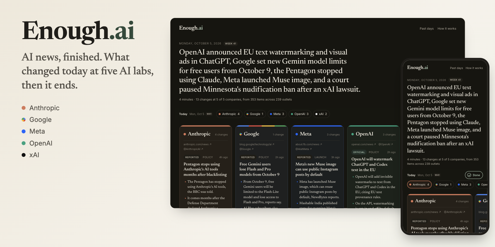

# Enough.ai

[](https://akash90gupta.github.io/enough.ai/)

[](https://github.com/akash90gupta/enough.ai/actions/workflows/daily.yml)

**AI news, finished.** One calm page every morning that tells you what actually changed at Anthropic, Google, Meta, OpenAI and xAI, shows where every fact came from, and then ends.

**▶ Read today's edition: [akash90gupta.github.io/enough.ai](https://akash90gupta.github.io/enough.ai/)**

> Written each morning by Claude from 300 to 400 items: the companies' own announcements plus coverage from 200+ outlets. No ads, no accounts, no tracking. It updates itself every day, and every edition is kept in this repo.

---

## Goal

I wanted to keep up with the five companies shaping AI without drowning in AI news. Specifically, a daily habit that:

- **Ends.** One page, about four minutes, with a clear "you're caught up".
- **Only tells me what changed.** What shipped, what got priced, what was ruled on. Not what someone predicts, teases or thinks.
- **Separates what a company said from what was reported about it.** "OpenAI announced" and "sources say OpenAI is working on" are very different sentences.
- **Shows its work.** If an AI decides what I read, I want to see what it read, what it left out, and why.

## Problem

AI news is the loudest beat in tech. On a typical day, about 350 items mention these five companies. Most of them are:

- **Repeats.** One interview quote becomes 25 articles. One Information scoop gets rewritten by 15 sites.
- **Speculation.** IPO valuations, release-date guesses, "AGI by" predictions, an AI chatbot's Bitcoin price forecast.
- **Hype in the headline.** "Game-changer", "drops", "stunning", "the end of".
- **Blurred sourcing.** A company announcement, a single anonymous leak, and a blogger's guess all look the same in a feed.

Meanwhile the few things that actually changed (a price change on Thursday, a new ad format, a court ruling) get buried. People who use these products, or build on them, end up either overwhelmed or uninformed.

## Approach

Three ideas shaped the product.

**1. The AI's job is judgment, not summarizing.** Summarizing 350 items is easy. Deciding which eight matter is the valuable part. The editor's brief ([prompts/editor.md](prompts/editor.md)) gives Claude three tests:

| Test | Example that fails it |
|---|---|
| **Something changed** | "OpenAI is reportedly working on...", "Google teases..." |
| **It matters beyond insiders** | Executive gossip, stock moves, a CEO's remark in an interview |
| **It can be sourced** | One outlet's anonymous scoop, unless it's big enough to label "Unconfirmed" |

Each company gets zero to five items, most important first. Each item is a plain headline, two or three short bullet points, and an optional "For you" line. A quiet company gets one calm line ("Nothing new from xAI today.") instead of filler.

**2. The model proposes, the code verifies.** Claude writes a structured draft. Before anything is published, plain code checks it:

- Every item must cite real ids from that morning's read. Unknown or reused citations are removed, and an item left with no sources is dropped.
- **"Official" requires the company's own post** among the sources. Otherwise it's downgraded.
- **"Reported" requires two or more outlets.** One outlet means "Unconfirmed".
- Outlet counts are computed from citations, never taken from the model, and the company itself doesn't count as an outside outlet.
- **Nothing stale.** Only the last 26 hours are read. An item whose newest source is older than that is dropped, and so is an item built only from sources already used in yesterday's edition.
- Everything that was read ends up somewhere. If the editor forgets to sort an item, it still appears under "left out", so "we read 353 items" is always literally true.

**3. Trust comes from receipts, not claims.**

- Every headline links straight to its best source: the company's own post when there is one. Google News redirect links are resolved to the real publisher address.
- Each item links to the company's own posts on X about that topic, and each card links to the company's newsroom and X account.
- Every item has a status badge (Official, Reported, Unconfirmed, Disputed) and a fold listing every source.
- At the bottom, "See the items we left out, and why" opens everything that was skipped, grouped by reason ("Hype and speculation", "Repeats and syndication", "Stock and valuation chatter"...), with a one-line explanation specific to that day.
- The full editor brief is on the [How it works](https://akash90gupta.github.io/enough.ai/how/) page, and every day's inputs and output are committed to [`data/`](data/).

## Trade-offs

- **The editor is made by one of the companies it covers.** Enough.ai is written by Claude, and Anthropic is one of the five. I chose to say this openly rather than hide it. The brief tells the model to be stricter, not softer, with Anthropic. Status labels are enforced in code. The "left out" drawer makes it easy to check whether any company got a pass.
- **Official feeds where they exist, search where they don't.** OpenAI, Google and Meta publish feeds. Anthropic's news page is read directly. x.ai blocks automated readers, so its own pages are found through Google News, and any item from a company's own domain counts as official.
- **X links are searches, not embeds.** Reading X requires a paid API, so Enough.ai links to a live search of the company's own posts on each topic instead. One tap, no tracking, no API key.
- **Headlines, not full articles.** The editor reads titles and short summaries, never full articles. That keeps Enough.ai fast, cheap and respectful of publishers, and every fact traces to text anyone can see. The cost is less nuance. The brief forbids filling gaps from the model's memory, which keeps it honest but sometimes leaves an item thinner than I'd like.
- **One call, not an agent.** A single request reads everything and writes the edition. An agent could open articles and dig deeper, but it would be slower, costlier and much harder to verify. For a daily page, predictability wins.
- **A static site, not an app.** GitHub Actions runs once a day and GitHub Pages serves the result. No server, no database, no login. It runs on a Claude subscription through Claude Code, so it costs nothing beyond that, and nothing to host. With a pay-per-use API key instead, a day's edition (about 25,000 tokens in and 27,000 out) costs well under a dollar.

## Decision / Direction

I chose to make **restraint the feature**. Most AI news products compete to show you more. Enough.ai competes to show you less and prove it didn't hide anything. That's also the shape I think AI should take in consumer products: let the model make the judgment call, constrain it with explicit rules, verify it with code, and give the user the receipts.

Next, if people use it:

- **A Friday "week in AI" edition**, built from the five daily editions, for people who only want to check in once.
- **Email delivery** for readers who want it in their inbox.
- **Corrections in public**, as a visible note on the day's page.

## Solution

```
05:00 PT   GitHub Actions wakes up
  read     src/read.mjs    official feeds + Anthropic's news page + Google News coverage per company,
                           last 26 hours, deduped                                 → data/reads/DATE.json
  write    src/write.mjs   Claude Opus 5.5 reads everything + yesterday's edition and returns
                           structured JSON; code verifies citations, statuses and freshness,
                           then resolves source links                            → data/editions/DATE.json
  build    src/build.mjs   static HTML: today, one page per day, archive, how-it-works, RSS
  publish  commit data/ to main, deploy site/ to GitHub Pages
```

Small details that matter:

- **One page, five cards.** Each company gets a card in its own colors (Anthropic clay, Google's four colors, Meta blue, OpenAI green, xAI black). On a laptop, all five sit side by side. On a phone, they become a row you swipe through, with the next card peeking in so you know there's more.
- **Today is always in reach.** A bar pinned to the top shows today's date, a chip per company with its count of changes, and a **✓ Done** button. The chip for the card you're looking at lights up, and tapping a chip jumps to that card.
- **Done means done.** Tapping Done tells Enough.ai you've read today's edition. It's remembered in your browser until tomorrow's edition arrives, and the page answers "You're caught up. See you tomorrow morning."
- **Every day has a date, a day and a week.** "Monday, October 5, 2026 · Week 41" at the top, and "Mon, Oct 5 · W41" in the pinned bar.
- **Finished days roll up.** Below today, the past two weeks are grouped by week ("Week 40 · Sep 28 to Oct 4"), one line per day with a colored dot per company. Tap a day to open its digest: each company's headlines, linked to their sources. The archive keeps every day in the same format.
- **Today rolls up too, once you're done.** After you tap Done, today collapses to a single line ("You finished today's edition") with a button to bring the cards back.
- **Built for phones first.** A compact pinned bar, swipeable cards with position dots, and tap targets of at least 40 pixels.
- **Honest when late.** If today's edition hasn't arrived yet, the page says so instead of passing off yesterday's as today's.
- **Welcome back.** If you've been away, it lists the days you missed (stored only in your own browser).
- **Light and dark**, keyboard navigable (arrow keys move between cards), and an RSS feed at [`/feed.xml`](https://akash90gupta.github.io/enough.ai/feed.xml).

### Run it yourself

```bash
npm install
npm run read                          # collect today's items
ENOUGH_WRITER=claude-code npm run write   # write with your logged-in Claude Code (Pro/Max)
# or: ANTHROPIC_API_KEY=... npm run write  # write with a pay-per-use API key
npm run build && npx serve site
```

To run your own copy:

1. Fork it and turn on GitHub Pages with "GitHub Actions" as the source.
2. Give the daily job a way to reach Claude, as a repository secret. Either:
   - **Free with a Claude Pro or Max plan:** run `claude setup-token` and save the token as `CLAUDE_CODE_OAUTH_TOKEN`, or
   - **Pay per use:** create a key at console.anthropic.com and save it as `ANTHROPIC_API_KEY`.
3. Set `SITE_URL` for your fork. To follow different companies, edit [`src/sources.mjs`](src/sources.mjs).

## What I learned building it

- **The prompt is a product spec.** Writing "what earns a place" forced me to define what counts as AI news. That definition, not the code, was the real design work.
- **"Use only what you were given" is the most important line.** Without it, the model fills in model names, prices and dates from memory. In AI, that memory is stale within weeks, and the reader can't tell which details are current.
- **Verification belongs in code.** Asking the model "is this official?" invites a confident wrong answer. Checking whether the company's own post is among the citations is free and always right.
- **Showing what you left out is the trust feature I'd bet on.** A short page only feels safe if you can see what didn't make it. The "left out" drawer turns "trust the AI" into "check the AI".
